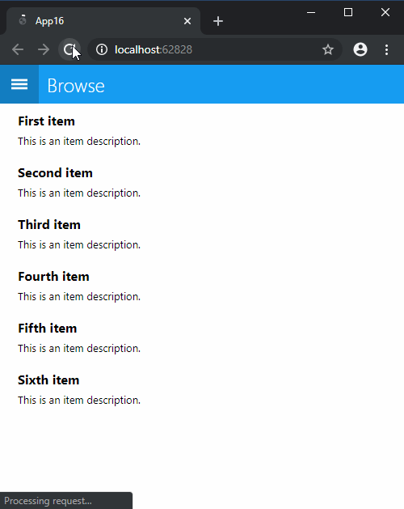

# Uno Platform WebAssembly Renderers for Xamarin.Forms 

This repository is the home of the Uno.Xamarin.Forms.Platform package, which provides a set of Xamarin.Forms renderers to provide WebAssembly support through the Uno Platform.

You can read about the Uno Platform https://platform.uno, and about Xamarin.Forms at https://www.xamarin.com/forms.




## Build Status ##

[](https://uno-platform.visualstudio.com/Uno%20Platform/_build/latest?definitionId=12&branchName=uno)

## Getting Started ##

- Require VS 2019 for Windows with ASP.NET Web Development and .NET Core cross-platform Workloads.

1. Create a Xamarin.Forms project 
    1. Check **Place project and solution in the same directory**
    1. Check **Windows (UWP)**
1. Using a **VS Developer Command Prompt**, navigate to the folder containing the solution
1. Type the following to install the latest templates:
    ```
    dotnet new -i Uno.ProjectTemplates.Dotnet::2.0
    ```
1. Then type the following to create the new WebAssembly project:
    ```
    dotnet new wasmxfhead
    ```
1. Open or Reload the solution in Visual Studio 
1. Set the Wasm project as the startup project 
1. Open the **Nuget Package manager** for the Wasm project and update the `Uno.Xamarin.Forms.Platform` project to the latest **stable** package 
1. Run the app using **Ctrl+F5** (without the Visual Studio debugger), and you’re good to go!

## Building the renderers ##

- Using Visual Studio 2019 (16.2 or later)
- Open the `Uno.Xamarin.Forms.Platform.sln` solution
- Build the `Xamarin.Forms.ControlGallery.Uno.Wasm` project
- Run it without the debugger (usually with `Ctrl+F5`)

## Coding Style ##

We follow the style used by the [.NET Foundation](https://github.com/dotnet/corefx/blob/master/Documentation/coding-guidelines/coding-style.md), with a few exceptions:

- We do not use the `private` keyword as it is the default accessibility level in C#.
- We use hard tabs over spaces. You can change this setting in VS 2015 via `Tools > Options` and navigating to `Text Editor > C#` and selecting the "Keep tabs" radio option. In Visual Studio for Mac it's set via preferences in `Source Code > Code Formatting > C# source code` and disabling the checkbox for `Convert tabs to spaces`.
- Lines should be limited to a max of 120 characters (or as close as possible within reason). This may be set in Visual Studio for Mac via preferences in `Source Code > Code Formatting > C# source code` and changing the `Desired file width` to `120`.

## Contributing ##

- [How to Contribute](https://github.com/xamarin/Xamarin.Forms/blob/master/.github/CONTRIBUTING.md)

### Reporting Bugs ###

We use [GitHub Issues](https://github.com/unoplatform/uno/issues/new/choose) to track issues.
